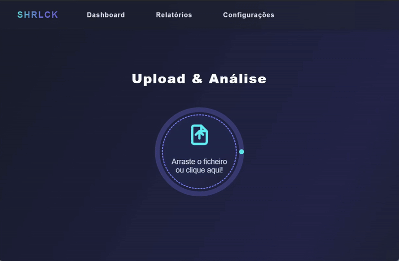
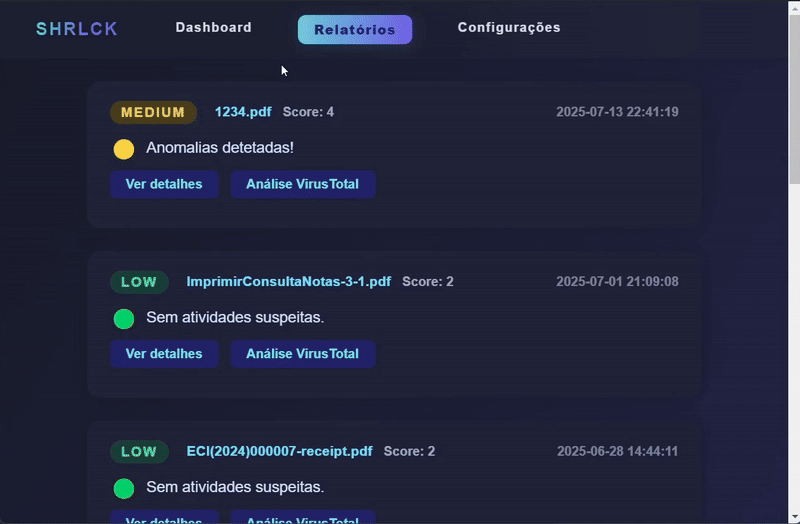

# <h1 align="center"><b> Defesa do Projeto Final LESI </b></h1>
<p align="center">| The Full Details of the Project will only be available until the completion of the Master's Thesis |</p>

---

<h1 align="center">Exploration of Solutions for Malware Recognition in Files Prone to Phishing Techniques</h1>

---

<h3 align="center">SHRLCK</h4>
<h3 align="center">(Strategic Heuristic Recognition & Lateralization of Cyber Knowledge) </h4>

##
## Upload

<div align="center">
  
</div>

<br>

```
O Utilizador poderá efetuar o Upload de 2 formas:
       
    - Arrastando o ficheiro (PDF) para a zona central da aplicação, com um tamanho limite de 50 Mbs 
    por ficheiro (limite prático imposto pelo Buffer interno do Chromium (IPC));
       
    - Clicando na zona central da mesma, escolhendo o ficheiro, através do explorador do sistema
    em uso, em que o limite do tamanho do ficheiro depende meramente da componente RAM do próprio
    SO/OS e da capacidade de processamento do Python/Electron, não existindo assim um limite fixo.
```

##
## Relatorios

<div align="center">
  
</div>

<br>

```
Os relatórios dos ficheiros analisados são visualizáveis com indicação de LOW/MEDIUM/HIGH e 
de cor Verde/Amarelo/Vermelho correspondente. Os mesmos são armazenados em JSON e em TXT, 
para maior facilidade de acesso, tendo a indicação da data em que foi feita a análise ao 
 ficheiro, titulo e score, no cartão correspondente do mesmo.
        
Além das opções de "Ver Detalhes" e "Análise VirusTotal", caso seja encontrada alguma técnica 
de null padding embutida no ficheiro, o mesmo é limpo e é dada a opção de 
guardar uma nova versão limpa desse mesmo ficheiro.
```

##
## Log Técnico

<div align="center">
  
</div>

<br>

```
O Log Técnico representa, em detalhe, informação que possa ser relevante para uma análise mais 
aprofundada do ficheiro.

Inclui Metadados entre os quais:
- Keywords verificadas, nível de entropia aplicada, posição do objeto malicioso, contagem de EOFs,
entre outros, onde apesar da aplicação ser de intuito simplista, permite também uma análise mais
detalhada por parte de um especialista.
```

##
## Api Externa

<div align="center">
  
</div>

<br>

```
O utilizador terá como opção analisar o documento (via Hash/Assinatura) sem que os dados do mesmo 
sejam expostos, podendo complementar a análise heuristica com uma análise dinâmica com acesso à 
base de dados da VirusTotal com +60 AV engines. 
```

##
## Futuramente

- Aplicar Machine Learning (ANN/CNN) para uma análise aos PE's (Programmable Executables);
- Desenvolver heuristicas mais robustas com integração de Yara-L, etc para implementação conjunta em SIEMs/EDRs;
- Aumentar capacidade para outros ficheiros DOS (Word / Excel / Etc);
- Viabilizar novas formas de deteção para restantes técnicas (Base64 / Etc)
- Pacote de Setup/Build com Idiomas (EN / FR / ESP / DE / RU)
